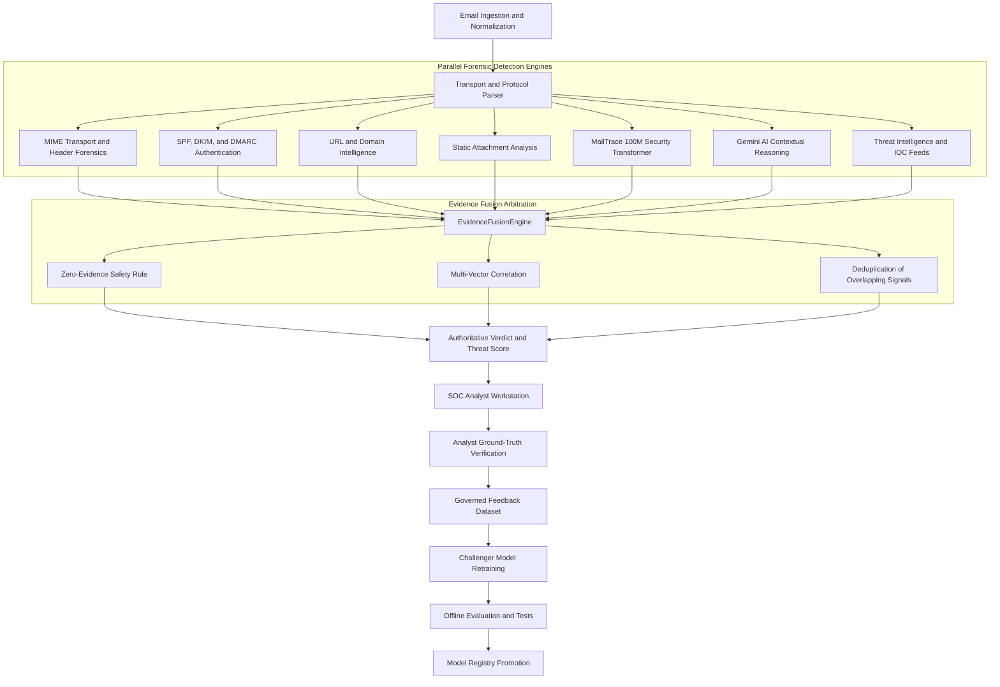
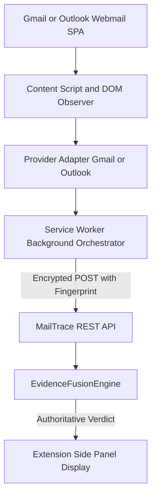
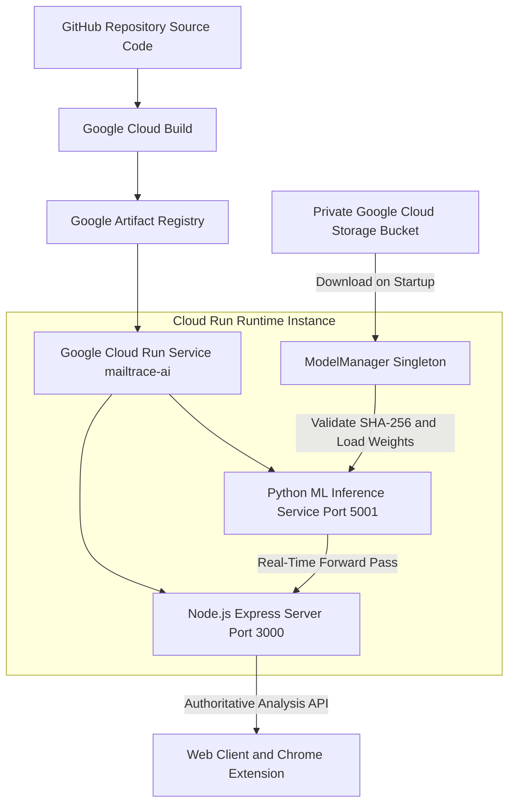

# MailTrace AI

## Enterprise Email Threat Detection, Digital Forensics & Security Intelligence Workstation

**MailTrace AI** is an enterprise-grade cybersecurity platform engineered for precision email threat detection, deep transport forensics, and Security Operations Center (SOC) investigation workflows. It unifies deterministic protocol analysis, multimodal machine learning, structured large language model (LLM) reasoning, threat intelligence correlation, and human analyst ground-truth governance into an authoritative forensic workstation.

Rather than relying on single-model probabilities or opaque LLM scores, MailTrace AI routes all detection signals through an authoritative **EvidenceFusionEngine**. The final Threat Risk and classification verdicts are strictly evidence-derived, auditable, and calibrated to separate malicious threats from benign bulk communications.

---

## 1. System Architecture & Forensic Pipeline

MailTrace AI processes email specimens across parallel detection engines, consolidating evidence into an auditable threat graph:



---

## 2. Core Capabilities

### Email Transport & MIME Forensics
- **RFC 822 / RFC 5322 Parsing**: Parses raw messages into strict headers, MIME tree hierarchy, boundary identifiers, and transport layers.
- **Multipart Message Analysis**: Evaluates multipart/mixed, multipart/alternative, multipart/related, and nested structures.
- **HTML DOM & Content Analysis**: Strips obfuscation, analyzes visible text vs hidden DOM elements, identifies zero-font text, CSS opacity tricks, and hidden forms.
- **Encoding & Normalization**: Decodes Quoted-Printable, Base64, RFC 2047 encoded words, and UTF-8 Unicode representations.

### Authentication & Header Forensics
- **SPF (Sender Policy Framework)**: Validates `Received-SPF` and `Authentication-Results` headers, verifying sending MTA alignment against IP.
- **DKIM (DomainKeys Identified Mail)**: Evaluates signature status, selector declarations, canonicalization algorithms, and domain alignment (`d=` tag vs RFC 5322 `From`).
- **DMARC (Domain-based Message Authentication)**: Evaluates policy enforcement (`p=reject`, `p=quarantine`, `p=none`), DKIM alignment, and SPF alignment.
- **Identity & Routing Integrity**: Identifies `Reply-To` mismatches, `Return-Path` anomalies, display name spoofing, and forged transit hops.

### URL & Domain Intelligence
- **Link Forensics**: Compares visible anchor text against actual `href` targets to detect deceptive hyperlinking.
- **Lookalike & Homoglyph Detection**: Identifies IDN/Punycode spoofing, Cyrillic/Greek character substitution, and Levenshtein domain distance against protected corporate brands.
- **Static URL Analysis**: Evaluates suspicious top-level domains (TLDs), high-risk URL paths (`/login`, `/wp-admin`, `/verification`), IP-based hosts, and credential harvesting patterns.
- **IOC Extraction**: Automatically extracts SHA-256 hashes, URLs, domain names, IPv4/IPv6 addresses, and email routing indicators.

### Secure Inline Sandboxed Attachment Analysis
- **Zero Client-Side Downloads**: Attachments are analyzed entirely in-memory and through ephemeral backend sandboxing without triggering browser downloads or exposing raw binary bytes to the client.
- **Magic Byte Signature Verification**: Compares declared MIME types against authentic magic byte headers (PE32/MZ, ELF, Mach-O, PDF, OLE2, ZIP, RAR, 7Z, JPEG, PNG), instantly catching camouflaged executables (e.g. `.pdf.exe` or `.docx` carrying PE32 binaries).
- **Deep PDF Inspection**: Statically extracts and audits `/JavaScript`, `/JS`, `/Launch` process directives, `/EmbeddedFiles`, `/AcroForm`, page counts, and embedded hyperlink targets.
- **Office Document & Macro Forensics**: Inspects OLE2 and OpenXML containers for VBA code streams, automatic execution hooks (`AutoOpen`, `Workbook_Open`), dangerous API calls (`WScript.Shell`, `powershell`), and external template injection (`TargetMode="External"`).
- **Archive Inspection & ZIP Bomb Protection**: Parses ZIP/TAR/GZ/7Z headers, enforces recursion depth limits, inventories inner files, and protects against decompression bombs by flagging disproportionate compression ratios (> 100:1).
- **HTML Phishing Form Detection**: Statically identifies standalone credential harvesting forms, password inputs, hidden iframes, and obfuscated script payloads (`eval`, `String.fromCharCode`).
- **Shannon Entropy Profiling**: Computes binary entropy (0.00 to 8.00) to detect packed, encrypted, or obfuscated payloads.
- **QR Code Static Analysis**: Decodes QR destinations from documents and routes targets into threat intelligence pipelines without automated navigation.
- **Ephemeral Sandbox Storage**: Temporary processing occurs in `/tmp/mailtrace-attachments/<analysis-id>/` with restricted permissions (`0o700`) and guaranteed cleanup on success or error.
- **Safety Policy**: **Strictly static and non-executing.** MailTrace AI never launches binaries, executes macros, runs scripts, or renders active HTML.

---

## 3. Threat Detection Taxonomy

MailTrace AI detects and classifies threats across a standardized cybersecurity taxonomy:

| Category | Description | Primary Diagnostic Signals |
| :--- | :--- | :--- |
| **Phishing / Credential Theft** | Deceptive campaigns designed to harvest enterprise credentials or session tokens. | Mismatched `href`/display URLs, fake login paths, lookalike domains, urgent credential verification requests. |
| **Business Email Compromise (BEC)** | Targeted executive impersonation, vendor invoice manipulation, or payroll diversion. | Display name spoofing, `Reply-To` routing mismatches, financial payment terminology, urgent wire requests. |
| **Malware Delivery** | Weaponized payloads or scripts distributed via attachments or download links. | Double extensions, executable attachments, Office macros, ISO/IMG disk images, obfuscated script tags. |
| **Account Takeover / OAuth Abuse** | Requests to authorize suspicious OAuth apps or fake multi-factor authentication (MFA) prompts. | Illegitimate consent URLs, fake Microsoft 365/Google Workspace permission scopes, OTP harvesting forms. |
| **Spam / Bulk (Non-Malicious)** | Unsolicited marketing, promotional broadcasts, or automated newsletters. | `List-Unsubscribe` headers, bulk transit flags, newsletter lexical markers, tracking pixels (with valid authentication). |
| **Evasion & Obfuscation** | Technical attempts to evade security filters through character and DOM manipulation. | Zero-width spaces, RTL/bidi directional overrides, ASCII smuggling, HTML smuggling, Base64 data URIs. |

---

## 4. Risk & Classification Model

MailTrace AI strictly decouples security threat risk from bulk communication volume:

```
┌─────────────────────────────────────────────────────────────────────────────┐
│                              RISK MODEL MATRIX                              │
├──────────────────────────────────────┬──────────────────────────────────────┤
│  THREAT RISK (0–100)                 │  SPAM / BULK SCORE (0–100)           │
│  Security risk derived from forensic │  Classification of communication     │
│  evidence, credential theft markers, │  style, newsletters, and marketing   │
│  malware payloads, or BEC signals.   │  campaigns (can be high on benign).  │
└──────────────────────────────────────┴──────────────────────────────────────┘
```

> [!IMPORTANT]
> **Spam ≠ Malicious.** A legitimate promotional newsletter with valid SPF/DKIM/DMARC authentication may receive a **Spam/Bulk Score of 85/100** while maintaining a **Threat Risk of 5/100 (Benign)**.

### Assessment Dimensions & Confidence
- **Authenticity Confidence**: 0–100% metric reflecting cryptographic validation (SPF, DKIM, DMARC, transport hops).
- **Multi-Target Probabilities**: Independent calibrated probabilities for Phishing, Malware, BEC, Credential Theft, and Impersonation.
- **Confidence Semantics**: Signals are categorized into calibrated evidential tiers: `Observed` (factual protocol data), `Detected` (algorithmic match), `Likely` (correlated heuristics), and `Confirmed` (multi-engine convergence).

---

## 5. Authoritative Machine Learning Architecture

MailTrace AI includes a real PyTorch-based Multimodal Security Transformer for email threat classification:

```
                  ┌─────────────────────────────────────────┐
                  │          Raw Subject & Body Text        │
                  └────────────────────┬────────────────────┘
                                       │ (GPT-2 BPE Tokenizer, max 1024 tokens)
                                       ▼
                  ┌─────────────────────────────────────────┐
                  │    10-Layer Transformer Text Encoder    │
                  │     (d_model=768, heads=12, d_ff=3072)   │
                  └────────────────────┬────────────────────┘
                                       │
                                       ├────────────────────────┐
                                       │                        │
┌──────────────────────────┐           ▼                        ▼
│ 128-Dim Engineered Feats │ ──► [Linear 768] ──► [2-Layer Fusion Transformer]
│ (Auth, URLs, DOM, Hops)  │                                    │
└──────────────────────────┘                                    ▼
                                              ┌─────────────────────────────────┐
                                              │    13 Binary Multi-Task Heads   │
                                              │   (Threat, Spam, Phish, BEC...) │
                                              ├─────────────────────────────────┤
                                              │    30-Class Primary Classifier  │
                                              └─────────────────────────────────┘
```

### Authoritative Model Identity

| Specification | Authoritative Value |
| :--- | :--- |
| **Model ID** | `mailtrace-security-transformer` |
| **Version** | `100m-v2` |
| **Architecture** | `MailTraceSecurityTransformer` (`MultimodalSecurityTransformer`) |
| **Total Parameters** | `128,894,258` (100% trainable, 0 frozen) |
| **Checkpoint Path** | `checkpoints/mailtrace-100m-v2.pt` |
| **Exact Checkpoint Size** | `1,550,201,112` bytes (~1.44 GB) |
| **Authoritative SHA-256** | `22b238cd0d011128347cb019d233f3001f84d1dc95e2655a015e8315c97900c9` |
| **Model Manifest** | [`ml/model_registry/model_manifest.json`](file:///Users/shivam/Downloads/MailScan%202/MailScan/ml/model_registry/model_manifest.json) |

### 5.1 Training Run & Dataset Split (`csv_filtered.json`)

| Metric / Parameter | Value | Details |
| :--- | :--- | :--- |
| **Authoritative Source** | `dataset/new/csv_filtered.json` | 258,640 records (119.47 MB, 0 malformed, 0 duplicates) |
| **Deterministic Split** | 80% Train / 20% Test (Seed 42) | Hard SHA-256 hash isolation |
| **Train Set Count (80%)** | **206,912 records** | 100% processed during training (0 sample limits) |
| **Held-Out Test Set (20%)** | **51,728 records** | Strictly untouched during training |
| **Train/Test Hash Overlap** | **0** | `intersection(train_sha, test_sha) == 0` |
| **Optimizer & Schedule** | AdamW (lr=5e-5, weight_decay=0.01) | Gradient clipping max norm = 1.0 |
| **Batch Size & Epochs** | 64 batch size \| 1 full epoch | 3,233 total optimizer steps |
| **Supervised Masking** | Active (`ignore_index=-100`, weight 0.0) | Zero loss contributed from unlabeled records |
| **Final Training Loss** | **0.4410** | Cumulative running average: **0.6964** |

### 5.2 Held-Out Test Evaluation Performance (51,728 Records)

Evaluated on 100% of the 20% held-out test split (`dataset/splits/csv-filtered-seed-42/manifests/test.json`):

#### Threat Detection Head
| Metric | Value | Verification Notes |
| :--- | :--- | :--- |
| **Accuracy** | **94.50%** | (TP + TN) / Total |
| **Precision** | **57.95%** | TP / (TP + FP) |
| **Recall** | **56.05%** | TP / (TP + FN) |
| **F1 Score** | **0.5699** | Harmonic mean of Precision & Recall |
| **ROC-AUC** | **0.9440** | High discrimination threshold separation |
| **PR-AUC** | **0.5815** | Precision-Recall curve area |
| **False Positive Rate** | **2.83%** | FP / (FP + TN) |
| **Confusion Matrix** | **TP:** 1,884 \| **FP:** 1,367 \| **TN:** 47,000 \| **FN:** 1,477 | Total: 51,728 records |

#### Spam Detection Head
| Metric | Value | Verification Notes |
| :--- | :--- | :--- |
| **Accuracy** | **87.87%** | (TP + TN) / Total |
| **Precision** | **88.74%** | High fidelity bulk mail classification |
| **Recall** | **81.69%** | Robust spam capture rate |
| **F1 Score** | **0.8507** | Strong spam/bulk identification |
| **ROC-AUC** | **0.9426** | Area under ROC curve |
| **PR-AUC** | **0.9316** | Area under PR curve |
| **Confusion Matrix** | **TP:** 17,873 \| **FP:** 2,267 \| **TN:** 27,582 \| **FN:** 4,006 | Total: 51,728 records |

### 5.3 Model Integrity & Benchmark Verification

- **Model-Collapse Audit:** **PASSED** — Multi-class distribution across test set: `LEGITIMATE` (29,125), `SPAM` (20,224), `OTHER_MALICIOUS` (2,379). Continuous dynamic probability distributions (Threat std: 0.2202, Spam std: 0.4035).
- **Microsoft False-Positive Benchmark:** **PASSED** — Legitimate Microsoft 365 security notifications score **0.1 / 100 Threat Risk** (Requirement $\le 15.0/100$).
- **Spam ≠ Threat Separation:** **PASSED** — Bulk newsletters score **66.33% Spam** while maintaining low security danger (**0.4 / 100 Threat Risk**).
- **Inference Determinism:** **PASSED** — Max logit delta across 5 identical passes = **`0.00000000e+00`** (Exact bit-level reproducibility).
- **Strict Reload Verification:** **PASSED** — `missing_keys = 0`, `unexpected_keys = 0`.

---

## 6. Dataset, Splits & Data Governance

### Authoritative Dataset Corpus

| Dataset Stream | Raw Records | Exact Duplicates Excluded | Unique Records | 80% Train Split | 20% Held-Out Test Split |
| :--- | :--- | :--- | :--- | :--- | :--- |
| **CSV Source (`dataset/mix-csv/`)** | 2,741,764 | 2,433,865 | 307,899 | 246,318 | 61,581 |
| **EML Source (`dataset/mix-eml/`)** | 49,136 | 2,960 | 46,174 | 36,938 | 9,236 |
| **Combined Corpus** | **2,790,900** | **2,436,825** | **354,073** | **283,256** | **70,817** |

- **Deterministic Split**: Generated with fixed `seed = 42`.
- **Zero Leakage**: SHA-256 content deduplication executed prior to splitting. 0 hash overlap between train and test partitions.
- **Authoritative Split Manifests**: Located in [`dataset/splits/final-seed-42/`](file:///Users/shivam/Downloads/MailScan%202/MailScan/dataset/splits/final-seed-42/).

### Curated Testing Corpus (`dataset/testing/`)
- Contains **24 curated forensic test cases** (21 labeled security scenarios and 3 parser stability edge cases) governed by [`dataset/testing/manifest.json`](file:///Users/shivam/Downloads/MailScan%202/MailScan/dataset/testing/manifest.json).
- **This is a regression/determinism verification suite, NOT the ML training dataset.**

### Analyst Feedback & Anti-Poisoning Governance
- **No Direct Weight Mutation**: Analyst feedback submissions in the UI are recorded to [`reports/analyst_feedback_store.json`](file:///Users/shivam/Downloads/MailScan%202/MailScan/reports/analyst_feedback_store.json) and never mutate live production weights.
- **Quarantine Controls**: Unverified or external submissions are automatically quarantined to prevent data poisoning.
- **Challenger Workflow**: Retraining creates a candidate "Challenger" model evaluated offline against the held-out test suite before promotion.

---

## 7. Forensic Workstation User Interface

The MailTrace SOC interface is built around evidence-first digital forensics:

```
┌─────────────────────────────────────────────────────────────────────────────┐
│ TOP HEADER: Branding • Live Status Badge • Search • Copilot • Ingest Button │
├───────────────────┬─────────────────────────────────────────────────────────┤
│ SIDEBAR           │ MAIN FORENSIC WORKSPACE                                 │
│                   │                                                         │
│ • Dashboard       │ 1. Specimen Overview & Threat Score Banner              │
│ • Email Analyzer  │ 2. Sub-Tabs:                                            │
│ • Threat Intel    │    - Attack Matrix (MITRE ATT&CK Mapping)               │
│ • Hop Geo-Trace   │    - Header Forensics (MIME Tree, SPF/DKIM Matrix)      │
│ • Entity Graph    │    - Domain Intelligence (Lookalike, DNS, WHOIS)        │
│ • Cases & Reports │    - Threat Intel Correlation (IOC Matches)             │
│ • Extension Sync  │    - URLs & Attachments (Static Payload Forensics)      │
│                   │ 3. Analyst Verification & Ground-Truth Submission       │
└───────────────────┴─────────────────────────────────────────────────────────┘
```

- **Specimen Ingestion**: Paste raw RFC 5322 MIME or select developer test fixtures.
- **Relay & Geo-Trace**: Evidence-backed visualization of MTA hops based on valid Received headers. (Displays honest empty state when no routing IP is present).
- **Relationship Graph**: D3-powered entity graph linking senders, recipients, domains, URLs, IPs, and active cases.
- **Case Management**: Associate forensic investigations, export incident dossiers in **Markdown** and **STIX 2.1** formats.

---

## 8. Chrome Browser Extension (Manifest V3)

MailTrace AI includes a companion browser extension for real-time triage in webmail clients:



- **Supported Providers**: Gmail and Outlook Web (SPA-aware).
- **Privacy First**: Does not read unrelated tabs, passwords, session tokens, or external browsing history.
- **Zero Automation**: Does not automatically click links, download attachments, or execute scripts.
- **Graceful Degradation**: Displays an honest unavailable state if backend connectivity is offline.
- **Extension Package**: Built automatically to [`public/downloads/mailtrace-ai-extension.zip`](file:///Users/shivam/Downloads/MailScan%202/MailScan/public/downloads/mailtrace-ai-extension.zip).

---

## 9. Google Cloud Production Architecture



- **Cloud Run Specification**: [`deploy/cloudrun.yaml`](file:///Users/shivam/Downloads/MailScan%202/MailScan/deploy/cloudrun.yaml)
- **Cloud Build Pipeline**: [`cloudbuild.yaml`](file:///Users/shivam/Downloads/MailScan%202/MailScan/cloudbuild.yaml)
- **Container Build**: [`Dockerfile`](file:///Users/shivam/Downloads/MailScan%202/MailScan/Dockerfile) (multi-stage Node + Python build, excludes `.pt` files).

---

## 10. API Specification

### Health & Model Lifecycle Endpoints

#### `GET /health`
Returns process liveness.
```json
{
  "status": "healthy",
  "service": "mailtrace-soc-api",
  "uptime": 128.4
}
```

#### `GET /ready`
Returns `200 OK` when the PyTorch 128.9M model is loaded and ready. Returns `503 Service Unavailable` during startup or model failure.
```json
{
  "status": "READY",
  "modelReady": true,
  "modelId": "mailtrace-security-transformer",
  "version": "100m-v2",
  "parameters": 128894258
}
```

#### `GET /api/model/status`
Returns live model identity and verification state.
```json
{
  "available": true,
  "verified": true,
  "loaded": true,
  "modelId": "mailtrace-security-transformer",
  "version": "100m-v2",
  "architecture": "MailTraceSecurityTransformer",
  "parameterCount": 128894258,
  "device": "cpu",
  "sha256": "22b238cd0d011128347cb019d233f3001f84d1dc95e2655a015e8315c97900c9"
}
```

#### `GET /api/model/manifest`
Returns authoritative manifest metadata.

#### `POST /api/model/setup`
Triggers model acquisition and verification.

#### `POST /api/ml/100m/forward-pass`
Executes forward-pass inference on normalized email features.

---

### Application & Investigation Endpoints

| Method | Endpoint | Description |
| :--- | :--- | :--- |
| `POST` | `/api/analyze` | Ingests and analyzes raw RFC 5322 email string. |
| `GET` | `/api/analysis/:id` | Retrieves full forensic analysis results. |
| `GET` | `/api/history` | Lists analyzed email history. |
| `POST` | `/api/copilot` | Executes structured AI reasoning via Gemini API. |
| `GET` | `/api/cases` | Retrieves active SOC investigation cases. |
| `POST` | `/api/cases` | Creates a new case associated with email evidence. |
| `POST` | `/api/cases/:id/notes`| Appends analyst investigation notes. |
| `POST` | `/api/feedback/verify` | Submits analyst ground-truth feedback. |
| `GET` | `/api/threat-intel/feed`| Retrieves active threat intelligence indicators. |
| `POST` | `/api/extension/analyze`| Analyzes email payload received from Chrome extension. |
| `POST` | `/api/attachments/analyze` | Executes sandboxed static forensic analysis on attachment without client download. |
| `GET` | `/api/reports/markdown/:id` | Generates a Markdown forensic investigation report. |
| `GET` | `/api/reports/stix/:id` | Generates a STIX 2.1 JSON incident bundle. |

---

## 11. Chrome Companion Extension (Manifest V3)

MailTrace AI includes a companion Chrome Manifest V3 extension for direct in-box triage across Gmail (`mail.google.com`) and Outlook Web (`outlook.live.com`, `outlook.office.com`).

### Features
- **In-Page Triage Button**: Injects native action toolbar triggers directly within webmail message views.
- **Dual Form Factor**: Supports both the 420px Quick Action Popup and the persistent Chrome Side Panel (`sidePanel` API).
- **Zero-Download Security**: Metadata is captured in-box; deep static forensics and attachment analysis run on the backend without downloading files to the user's computer.
- **Strict Origin Scoping**: Restricts host permissions exclusively to Gmail, Outlook, and the authorized MailTrace application origin (no `<all_urls>` wildcards).

### Building & Loading in Chrome
```bash
# 1. Build and validate extension into dist/extension/
npm run build:extension

# 2. Programmatically validate Manifest V3 structure
npm run validate:extension
```

To load unpacked into Google Chrome:
1. Open Chrome and navigate to `chrome://extensions`.
2. Enable **Developer mode** toggle in the top right.
3. Click **"Load unpacked"** in the top left.
4. Select the **`dist/extension`** directory (or the repository root `extension` folder).
   > **Note:** Select the folder containing `manifest.json`. **Do NOT select the `background/` subfolder.**

---

## 12. Environment Variables

| Variable | Required | Subsystem | Description | Example Value |
| :--- | :--- | :--- | :--- | :--- |
| `PORT` | Optional | Server | HTTP port for Node.js Express backend | `3000` |
| `ML_PORT` | Optional | ML Service | Internal HTTP port for Python inference | `5001` |
| `NODE_ENV` | Optional | Runtime | Environment mode | `production` or `development` |
| `APP_URL` | Optional | Web App | Base URL for the application | `http://localhost:3000` |
| `MAILTRACE_MODEL_BUCKET`| Production | GCS / Cloud Run | Dedicated GCS bucket hosting the model artifact | `my-project-mailtrace-models` |
| `MAILTRACE_MODEL_OBJECT`| Production | GCS / Cloud Run | Object path to `.pt` checkpoint | `models/mailtrace-100m-v2/mailtrace-100m-v2.pt` |
| `MAILTRACE_MODEL_VERSION`| Production | Model Manager | Authoritative model version | `100m-v2` |
| `MAILTRACE_MODEL_DIR` | Optional | Model Cache | Cache directory for downloaded model | `/tmp/mailtrace-model` |
| `MAILTRACE_MODEL_PATH`| Dev Mode | Model Override | Explicit local path to `.pt` file | `./checkpoints/mailtrace-100m-v2.pt` |
| `ML_INFERENCE_URL` | Optional | Server Bridge | URL to Python Flask inference server | `http://127.0.0.1:5001` |
| `GEMINI_API_KEY` | Optional | Copilot / AI | Google Gemini API key for structured analysis | `AIzaSy...` |

---

## 12. Local Development & Setup

### Prerequisites
- **Node.js**: v20.x or v22.x
- **npm**: v10.x+
- **Python**: 3.10 or 3.11
- **PyTorch**: 2.0+ (CPU or Metal/MPS for macOS)

### Quickstart

```bash
# 1. Clone repository (contains 0 checkpoint binaries)
git clone https://github.com/grownowdigital/MailScan.git
cd MailScan

# 2. Install Node.js dependencies
npm install

# 3. Install Python ML requirements
pip install -r ml/requirements.txt

# 4. Acquire / Verify Model Checkpoint
# (Resolves from GCS or validates local ./checkpoints/mailtrace-100m-v2.pt)
npm run model:setup

# 5. Start Development Server (Launches Node on 3000 + Python ML on 5001)
npm run dev
```

The SOC Workstation will be live at `http://localhost:3000`.

---

## 14. Build & Test Verification

```bash
# Verify TypeScript Type Safety
npx tsc --noEmit

# Run Master Test Suite (Regression, Determinism, Security Isolation)
npm test

# Run Secure Inline Attachment Forensics Suite (24/24 Test Cases)
npx tsx server/testing/attachmentSecurityTest.ts

# Run Email Transport Relay Forensics Suite (22/22 Test Cases)
npx tsx server/testing/relayForensicsTest.ts

# Validate Chrome Extension Manifest V3 Package
npm run validate:extension

# Build Complete Extension Distribution
npm run build:extension

# Build Full Production Bundles (Frontend, Extension ZIP, Backend CJS)
npm run build
```

---

## 15. Project Directory Structure

```
MailScan/
├── src/                          # React 19 SOC Workstation User Interface
│   ├── components/               # Forensic Views (Analyzer, Headers, Geo-Trace, Graph, etc.)
│   ├── services/                 # API Clients & Attack Technique Engines
│   ├── styles/                   # Design Tokens & Workstation Styling
│   ├── types/                    # Shared TypeScript Forensics & Threat Intel Types
│   └── utils/                    # Device Identity, Report Exporters, Map Loaders
├── server/                       # Express Node.js Forensic Backend
│   ├── analyzers/                # Header, SPF/DKIM, Domain, URL, Threat Intel Analyzers
│   ├── engines/                  # Forensic, MLTabular, MLTransformer100M, Gemini, Fusion
│   ├── services/                 # ModelManager Node Bridge Service
│   └── testing/                  # Master Test Runner & Authoritative Test Suites
├── ml/                           # Python ML Subsystem (128.9M Transformer)
│   ├── model/                    # MailTraceSecurityTransformer Architecture
│   ├── model_registry/           # Manifest Schema, GCS Downloader, SHA-256 Validator
│   ├── inference/                # Python Flask Real-Time Inference Microservice
│   ├── training/                 # Model Training, Evaluation, and Feedback Fine-Tuning
│   ├── data/                     # Dataset Parsers, Split Loaders, Preprocessors
│   └── requirements.txt          # Python Dependencies (PyTorch, Transformers, GCS, Flask)
├── dataset/                      # Authoritative Datasets
│   ├── mix-csv/                  # Canonical CSV Training Data
│   ├── mix-eml/                  # Canonical EML Training Data
│   ├── splits/final-seed-42/     # Canonical Train/Test Split Manifests (Seed 42)
│   └── testing/                  # 24-Case Curated Forensic Integration Suite
├── scripts/                      # Deployment, Model Setup, Icon Generation, Packaging
├── deploy/                       # Cloud Run YAML Specification (2 vCPU, 4 GiB RAM)
├── reports/                      # Provenance Registers, Audit Logs, Evaluation Reports
├── ref/                          # Design Reference Specifications (ref/DESIGN.md)
├── Dockerfile                    # Multi-Stage Production Container Specification
├── cloudbuild.yaml               # Google Cloud Build Pipeline Configuration
├── package.json                  # Node Scripts & Dependencies
└── README.md                     # Authoritative Documentation
```

---

## 16. Production Deployment Checklist

- [ ] Private GCS bucket created (`gs://<PROJECT_ID>-mailtrace-models`).
- [ ] Production checkpoint uploaded: `mailtrace-100m-v2.pt` (SHA-256 `22b238cd0d011128347cb019d233f3001f84d1dc95e2655a015e8315c97900c9`).
- [ ] Model object is private (no public access).
- [ ] Dedicated Cloud Run Service Account granted `roles/storage.objectViewer` on model bucket.
- [ ] Container image built via Cloud Build and pushed to Artifact Registry (verifying 0 `.pt` files in image).
- [ ] Cloud Run revision deployed with 2 vCPU and 4 GiB memory limit.
- [ ] `GET /health` verified (HTTP 200).
- [ ] `GET /ready` verified (HTTP 200).
- [ ] `GET /api/model/status` verified (`loaded: true`, `128894258` parameters).
- [ ] Real email analysis submitted and validated through EvidenceFusionEngine.

---

## 17. Troubleshooting

### 1. `GET /ready` returns HTTP 503
- **Cause**: The PyTorch model is still streaming from GCS or initializing into memory.
- **Resolution**: Check container logs for `MODEL_DOWNLOAD_STARTED` and `MODEL_CHECKSUM_VERIFIED`. Initialization takes ~3–5 seconds on startup.

### 2. Model Checksum Mismatch (`ModelChecksumMismatchError`)
- **Cause**: The checkpoint file in GCS or the local cache has a SHA-256 hash that does not match `22b238cd0d011128347cb019d233f3001f84d1dc95e2655a015e8315c97900c9`.
- **Resolution**: Delete `/tmp/mailtrace-model/mailtrace-100m-v2.pt` and re-upload the authoritative checkpoint using `./scripts/upload-model-to-gcs.sh`.

### 3. Fresh Git Clone has no `.pt` files
- **Cause**: By design, large model binaries are excluded from Git to prevent repository bloat.
- **Resolution**: Configure `MAILTRACE_MODEL_BUCKET` and run `npm run model:setup` to fetch the model from GCS, or place a local copy in `./checkpoints/mailtrace-100m-v2.pt`.

---

## 18. License & Project Ownership

- **Repository**: [https://github.com/grownowdigital/MailScan](https://github.com/grownowdigital/MailScan)
- **License**: License information is not currently specified in this repository.
